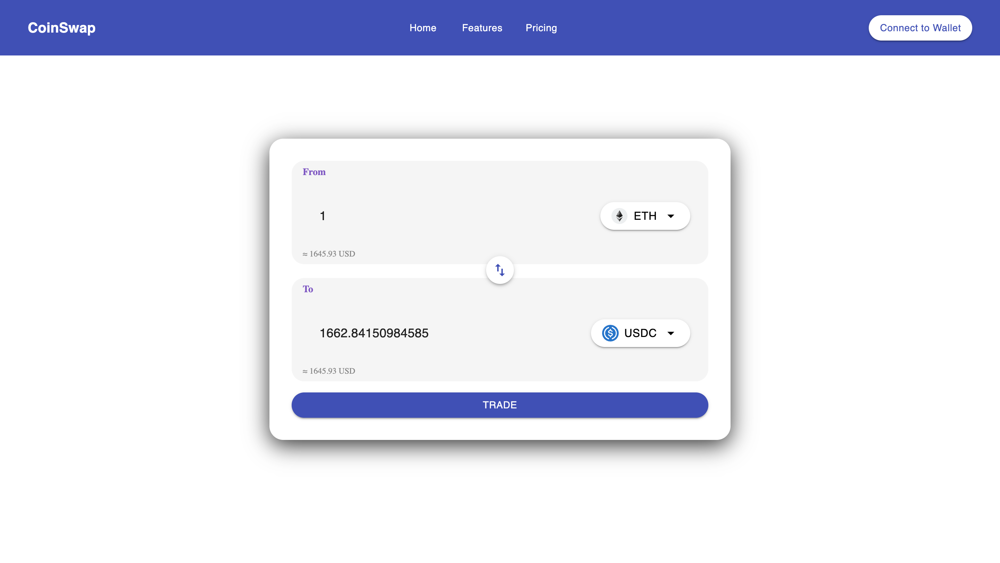

# **CoinSwap**

CoinSwap is a React-based cryptocurrency swapping interface built with **Vite**, **TypeScript**, **Material UI**, and **Framer Motion** for a smooth UI experience. This project provides a fast and optimized frontend for swapping tokens.

---

## **🛠️ Installation & Setup**

To set up the project locally, follow these steps:

### **1️⃣ Clone the Repository**

```bash
git clone https://github.com/Seven0730/code-challenge.git
cd problem2/coinswap
```

### **2️⃣ Install Dependencies**

```bash
npm install
```

### **3️⃣ Start the Development Server**

```bash
npm run dev
```

This will start a local development server. Open **`http://localhost:5173/`** in your browser to view the app.

---

### **Showcase**

`https://seven0730.github.io/code-challenge`


---

### **💡 Usage**

1. **Connect your wallet** .
2. **Select tokens** to swap.
3. **Enter the swap amount** and confirm.
4. **Transaction confirmation** and success notification.
